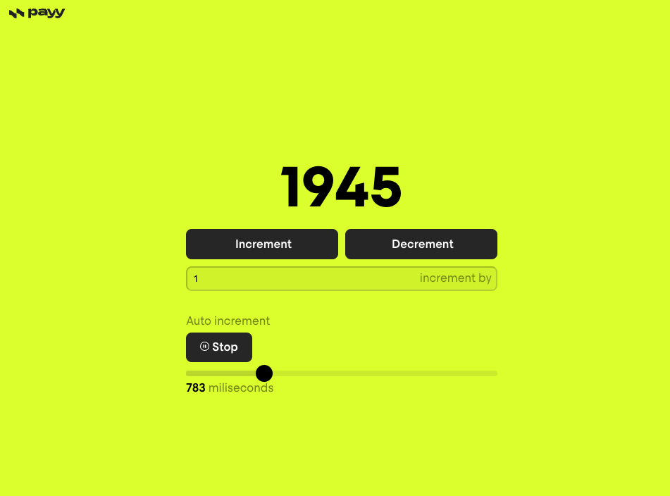

# Payy test case

> Live demo link [_here_](https://payy-interval.vercel.app/).

## Table of Contents

- [General Info](#general-information)
- [Screenshots](#screenshot)
- [Technologies Used](#technologies-used)
- [Setup](#setup)
- [Available Scripts](#available-scripts)
- [Areas for Improvement](#areas-for-improvement)

## General Information

User able to select betting type and get info about races, horses, time etc.

## Screenshot

## Technologies and libs Used:

- React
- Typescript
- Vite
- react-range-slider-input

## Setup

Environment requirements

> The project uses Node.js v20 and npm v8.
> The easiest way to manage different Node versions is nvm.

NVM

> Install NVM - link

1. After the installation makes sure to close all Terminal instances.
1. Currently project working with version 20 - in the terminal type in: `nvm use stable`
1. Set default node version by typing this command in the terminal: `nvm alias default v20`
1. npm version should be 8.0.0 and above - to install the latest version run this command in the terminal: `nvm install-latest-npm`

Project installation

1. In the terminal navigate to the root folder
1. run `nvm use`
1. run `npm i`
1. Now you can run project in development mode using `npm start` command

## Available Scripts

In the project directory, you can run:

### `npm dev`

Runs the app in the development mode.\
Open [http://localhost:3000](http://localhost:3000) to view it in your browser.

The page will reload when you make changes.\
You may also see any lint errors in the console.

### `npm run build`

Builds the app for production to the `build` folder.\
It correctly bundles React in production mode and optimizes the build for the best performance.

The build is minified and the filenames include the hashes.\
Your app is ready to be deployed!

## Areas for Improvement

1. Project should be covered by unit-tests at least 80%.
2. Components should be well decomposed and separated by modules, using MVC architecture(choose another architecture if it's make sense for you).
3. Apply some Styles managment lib according to next step requirements (desired styled-components or tailwind)
